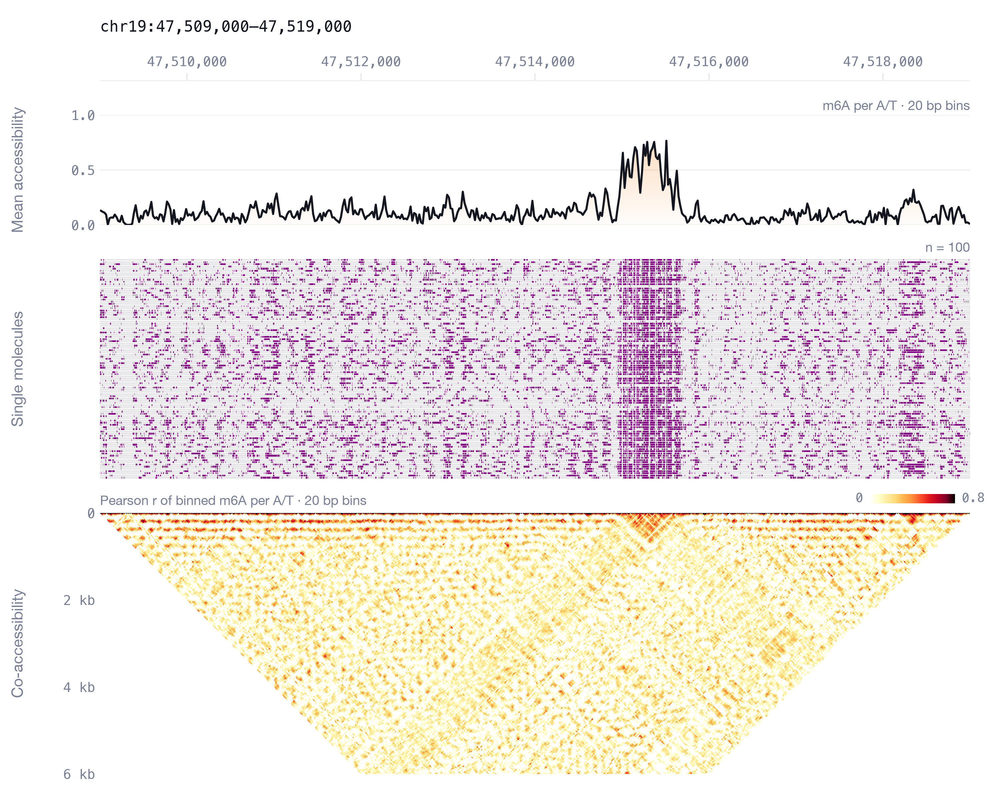
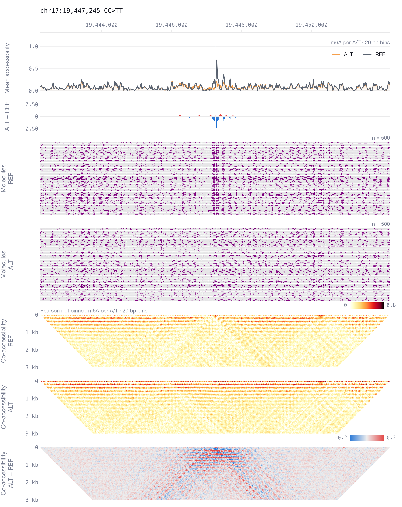

<p align="center">
  
</p>

# Mola

*Predicting single-molecule chromatin distribution from DNA sequence*

Mola generates single-molecule chromatin fibers from DNA sequence alone. Each generated fiber has
base-resolution accessibility (m6A) and CpG methylation over 10 kb, and together the generated
fibers approximate the distribution of single-molecule chromatin states measured by Fiber-seq.
This repository contains code for running the trained model and training new models; code to
reproduce our analyses and figures is in the
[manuscript repository](https://github.com/jzhoulab/mola_manuscript).

<picture>
  <source media="(prefers-color-scheme: dark)" srcset="docs/overview-dark.gif">
  
</picture>

<sub>Mola learns the distribution of single-molecule chromatin states of a sequence, P(state |
sequence), where each peak is a configuration of the chromatin fiber, and draws molecules from it:
each generated molecule is one state, with its own nucleosomes, accessible DNA, and bound
factors.</sub>

## What is S2d?

Most sequence models are sequence-to-function (s2f) models: for a DNA sequence, they predict the
average over all the cells or molecules in an assay. On single molecules, the same sequence can
have many chromatin states. A regulatory element is open on some molecules and covered by a
nucleosome on others, and two distant elements open together on some molecules but not on others.
The average track hides all of this. The prediction target for single-molecule data is therefore
not one averaged profile but a probability distribution over chromatin states: which states can
exist for a sequence, how frequently they occur, and how they are coordinated across positions.

A sequence-to-distribution (S2d) model learns this conditional distribution, P(state | sequence),
and generates single-molecule chromatin states from it. Each generated molecule is a sample, one
possible chromatin state for the input sequence, and many independent samples form a population
that approximates the measured molecules: their frequencies, variability, and co-accessibility.
Its average is what an s2f model predicts, while the rest is what single-molecule data add.
Because the model is conditioned only on DNA sequence, editing the input sequence is the
computational analog of a genetic perturbation. The framework applies to single-molecule
regulatory genomics in general, and Mola is the S2d model we trained on Fiber-seq.

## What is Mola?

Mola (Model of single-molecule long-read chromatin accessibility) is a score-based diffusion model
conditioned on DNA sequence. During training, measured molecules are progressively corrupted with
Gaussian noise, and a 1D U-Net denoiser, conditioned on the one-hot sequence, learns to recover
them. The denoiser thereby estimates the conditional score, the direction toward chromatin states
more likely for the input sequence. New molecules are generated by integrating the reverse
diffusion process from pure noise, and the neighborhood of a chromatin state can be explored with
Langevin dynamics at a fixed noise level. The released model was trained on deep GM12878 Fiber-seq
data (Vollger et al. 2025) with chr8, chr9, and chr10 held out.

You can use Mola to:

- generate molecules for any 10 kb sequence: a region of the genome, an edited region, or a
  designed sequence;
- run in silico experiments on single molecules, such as inserting motifs and measuring nucleosome
  opening and phasing or co-accessibility between distant elements;
- predict how a variant changes mean accessibility, the distribution of states, and the
  coordination with nearby elements;
- simulate pseudo-dynamic trajectories with Langevin dynamics ([`dynamics/`](dynamics)).

## Installation

Use Python 3.10 or newer. Install PyTorch for your GPU following the
[PyTorch guide](https://pytorch.org/get-started/locally/), then run:

```bash
git clone https://github.com/jzhoulab/mola.git
cd mola
pip install -r requirements.txt
```

Download the trained model (862 MB, from Zenodo record
[10.5281/zenodo.23108712](https://doi.org/10.5281/zenodo.23108712)) and the hg38 genome into
`resources/`, where all scripts look by default:

```bash
mkdir -p resources
wget -O resources/mola.pth "https://zenodo.org/records/23108712/files/mola_gm12878_10kb.pth?download=1"
wget -O - https://hgdownload.soe.ucsc.edu/goldenPath/hg38/bigZips/hg38.fa.gz | gunzip -c > resources/hg38.fa
```

The first run indexes the genome, which takes a few minutes. Coordinates use hg38; regions are
0-based and end-exclusive; variant positions are 1-based, as in a VCF.

Run the scripts from the repository root, or add the repository to your Python path to
`import mola` elsewhere:

```text
mola/             model, sampling, sequence editing, and summaries
mola_predict.py   command-line interface
dynamics/         pseudo-dynamic trajectories with Langevin dynamics
train/            training script and notes on the data
docs/             logo and figures (the animation is also there as a still, overview.png)
```

## Quick start

```bash
python mola_predict.py sample chr19:47509000-47519000 -n 100 -o napa.npz
python mola_predict.py summarize napa.npz
```

The first command generates 100 molecules for the 10 kb around the NAPA promoter, which takes
about 20 s on one H200 GPU (use `--device cpu` to run on a CPU, at about 10 s per molecule). The
second writes this figure, together with the tables described below:



## Command-line interface

| Command | Output |
|---|---|
| `sample <region>` | molecules for a region |
| `variant <chrom:pos> <ref> <alt>` | molecules for both alleles of a substitution |
| `summarize <file.npz>` | tables and a figure for any of the above, or for a frame of [`dynamics/`](dynamics) trajectories |

The key options of `sample` and `variant` are below; `python mola_predict.py <command> -h` lists
all options of a command.

| Option | Default | Description |
|---|---|---|
| `-n` | 100 | Number of molecules (per allele for `variant`) |
| `--sampler` | `euler` | ODE integrator: `euler`, or `heun` (second order; 2 × steps − 1 network evaluations) |
| `--steps` | 10 | Steps of the noise schedule |
| `--seed` | 0 | Random seed; the same seed gives the same molecules, and `variant` uses it for both alleles |
| `--batch-size` | 50 | Molecules per model call; lower it if the GPU runs out of memory |
| `--device` | `cuda` | `cuda` or `cpu` |
| `--window` | 10000 | `variant` only: length of the window centered on the variant, a multiple of 400 bp |
| `--binarize` | off | `sample` only: round the outputs to 0 or 1 |
| `--masked` | off | For models trained with the masked loss described in [`train/`](train) |
| `--model`, `--genome` | `resources/mola.pth`, `resources/hg38.fa` | The trained model and the hg38 FASTA |

**sample** writes `signals`, an array of shape (molecules, 2, length) with m6A in channel 0 and CpG
methylation in channel 1, together with the one-hot `sequence` and the coordinates. Both channels
use the scale of Fiber-seq likelihoods divided by 256. Generated values are not clipped and can
fall outside [0, 1]; m6A is only meaningful at A/T bases and methylation only at CpGs.
`--binarize` rounds and clips them to 0 or 1.

**variant** generates REF and ALT molecules in the same window (10 kb by default), centered on
the variant, using the same seed. REF must match the genome. Only substitutions are supported,
so REF and ALT must have the same length.

```bash
python mola_predict.py variant chr17:19447245 CC TT -n 500 -o ctcf_variant.npz
python mola_predict.py summarize ctcf_variant.npz
```

It prints the mean-accessibility effect, log2[(μ_ALT + 10⁻⁶) / (μ_REF + 10⁻⁶)], where μ is the
mean m6A over all molecules in the 200 bp centered on the variant (−1.39 for this CTCF-site
variant). `summarize` then compares the alleles: their mean tracks and difference, the molecules
for each allele, and co-accessibility for REF, ALT, and their difference.



**summarize** writes the following files next to the input:

| File | Contents |
|---|---|
| `<prefix>.png` | mean accessibility, single molecules, and co-accessibility |
| `<prefix>.mean.csv` | mean m6A and methylation at each position, with the reference base |
| `<prefix>.molecules.csv` | per molecule: mean m6A over A/T bases, mean methylation over CpG bases, and the fraction of CpG bases called methylated (≥ 0.5) |
| `<prefix>.coaccessibility.npy` | Pearson r between 20 bp bins of m6A at A/T bases, across molecules (`--bin` to change) |
| `<prefix>.bam` | with `--bam`: the molecules as aligned reads, for [calling footprints](#calling-footprints-with-fiberhmm) |

For a variant file, it writes one set per allele (`<prefix>.ref.*`, `<prefix>.alt.*`) and a
comparison figure (`<prefix>.png`). `--format pdf` saves the figures as PDF instead, with editable
text, and `--format png pdf` saves both.

### Calling footprints with FiberHMM

Mola generates m6A and CpG methylation, not nucleosome or footprint calls. To call them, write the
molecules to a BAM and run [FiberHMM](https://github.com/fiberseq/FiberHMM) on it as on measured
Fiber-seq reads:

```bash
python mola_predict.py summarize napa.npz --bam
fiberhmm-call -i napa.bam -o napa.fiberhmm.bam --enzyme hia5 --seq pacbio --prob-threshold 128 -c 4
samtools sort -o napa.fiberhmm.sorted.bam napa.fiberhmm.bam && samtools index napa.fiberhmm.sorted.bam
fiberhmm-extract -i napa.fiberhmm.sorted.bam -o napa_fiberhmm --footprint --msp --tf --bed-only
```

Each molecule becomes one read aligned to the region, with m6A at every A and T and CpG methylation
at the C of every CpG in MM/ML tags. The values are clipped to [0, 1] and scaled to ML probabilities
of 0 to 255, so `--prob-threshold 128` counts m6A where the generated value is at least 0.5.
`fiberhmm-extract` writes BED12 files of nucleosome footprints, MSPs, and TF footprints for each
molecule. For a variant file, `--bam` writes `<prefix>.ref.bam` and `<prefix>.alt.bam`; for
trajectories, it writes the frame chosen by `--frame`. Writing the BAM needs pysam
(`pip install pysam`); we tested it with FiberHMM 2.11.0.

## Python

The same steps in Python, using a one-hot sequence:

```python
import torch
import mola

device = "cuda"  # use "cpu" without a GPU
model = mola.load_model("resources/mola.pth", device=device)
genome = mola.load_genome("resources/hg38.fa")
seq = genome.get_encoding_from_coords("chr19", 47509000, 47519000)   # (10000, 4)

torch.manual_seed(0)
x = mola.sample(model, seq, 100, device=device)    # (100, 2, 10000)

mean = x[:, 0].mean(axis=0)                       # mean accessibility at each position
coacc = mola.coaccessibility(x[:, 0], 20, seq)    # co-accessibility between 20 bp bins of A/T bases
per_molecule = mola.molecule_means(x, seq)        # accessibility and methylation of each molecule
mola.write_bam(x, seq, "chr19", 47509000, "napa.bam")   # aligned reads for FiberHMM
```

To compare generated with measured molecules, use `mola.agreement(x, observed, seq)`. It returns
the Pearson r between their mean accessibility profiles at A/T bases and the mean Pearson r
between corresponding rows of their 100 bp co-accessibility maps, with a split-half ceiling for
each metric. `observed` holds measured molecules on the same scale, such as the likelihoods of the
reads that span the window divided by 256.

An in silico experiment edits the input. To insert a motif, overwrite the reference bases with
its consensus sequence, preserving the sequence length. Sample again with the same seed so that
the two sets of molecules are paired:

```python
edited = mola.insert(seq, "GCCGCCAGGGGGCGCCG", 5000)   # CTCF consensus at 0-based position 5,000
torch.manual_seed(0)
x_edited = mola.sample(model, edited, 100, device=device)
print(x[:, 0, 4900:5100].mean(), x_edited[:, 0, 4900:5100].mean())
```

A substitution uses the same kind of edit. `mola.random_windows(genome, 20, "chr10")` draws
random background windows for a screen.

## Pseudo-dynamics

[`dynamics/`](dynamics) has the script for pseudo-dynamic trajectories with Langevin dynamics, and
a description of its hyperparameters.

## Training

[`train/`](train) has the training script and notes on the data.

## Citation

Wang R, Jin J, Pott S, Zhou J. Predicting single-molecule chromatin distribution from DNA
sequence.

The trained model is archived at Zenodo, [10.5281/zenodo.23108712](https://doi.org/10.5281/zenodo.23108712).

## License

Mola is available for academic research use only; commercial use is not permitted. See
[LICENSE](LICENSE).
